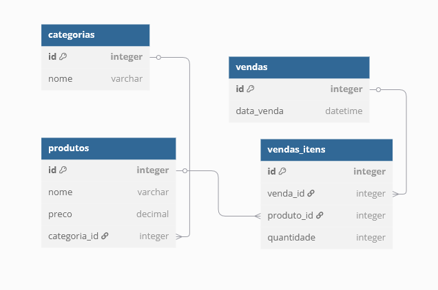

# 🛍️ Projeto de CRUD - Loja Virtual com Área Administrativa (PHP + MySQL)

## Entrega
- Seu projeto deverá estar salvo no GIT.
- Em dupla
- Envio do link do GIT via e-mail para rodrigo.noescobar@gmail.com
- Data e hora para entrega **28/05/2025 às 19h**
    - **Entregas feitas após este horário e data serão canceladas**
- *Alunos que não entregarem o trabalho deverão fazer avaliação substitutiva*
- A correção será em sala, fileira por fileira
- Todos os alunos devem estar presentes para a assinatura da lista de presença
- **A correção terá início dia 28/05/2025 às 19h**

## 🎯 Objetivo

Desenvolver um sistema completo de loja virtual com duas áreas principais:

- **Área Pública**: acessível a qualquer visitante (site da loja)
- **Área Segura (Administrativa)**: acessível apenas após login (painel administrativo)

## 🧰 Tecnologias Utilizadas

- **Linguagem**: PHP (sem frameworks)
- **Banco de Dados**: MySQL
- **Frontend**: HTML + CSS
- **Segurança**: Sessões PHP para autenticação

---

## 🔐 Área Segura - Painel Administrativo

### Funcionalidades:
- Login e logout com controle de sessão
- CRUD de:
  - Categorias
  - Produtos (com categoria)
  - Vendas (listagem e visualização)

### Exemplo de Rotas:
```
/admin/login.php
/admin/dashboard.php
/admin/categorias/index.php
/admin/produtos/index.php
/admin/vendas/index.php
```

## 🌐 Área Pública - Loja Virtual

### Funcionalidades:
- Listagem de produtos por categoria
- Página de detalhes de um produto
- Carrinho de compras (usando sessão)
- Finalização de compra (simula uma venda)
- Página de agradecimento

### Exemplo de Rotas:
/index.php
/produto.php?id=1
/categoria.php?id=3
/carrinho.php
/finalizar.php


## 🧱 Estrutura do Banco de Dados

O banco de dados terá as seguintes tabelas:

- `categorias (id, nome)`
- `produtos (id, nome, preco, categoria_id)`
- `vendas (id, data_venda)`
- `vendas_itens (id, venda_id, produto_id, quantidade)`

📌 Relacionamentos:
- Um produto pertence a uma categoria
- Uma venda possui vários itens
- Um item de venda pertence a um produto e uma venda

### 🖼️ Diagrama Entidade-Relacionamento

 <!-- Renomeie o arquivo gerado como "diagrama.png" e coloque na raiz do projeto -->
